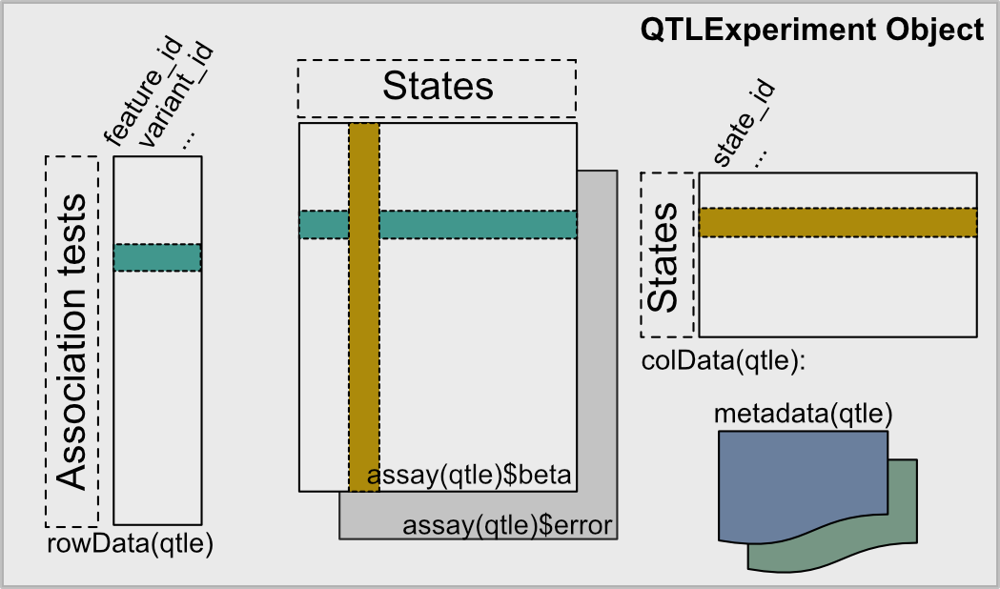

```{r knitr-options, echo=FALSE}
knitr::opts_chunk$set(warning=FALSE, error=FALSE, message=FALSE, 
                      fig.height=6, fig.width=8)
```


# 1. Motivation

The `QTLExperiment` class is a Bioconductor container for storing and manipulating QTL summary statistics (e.g., effect sizes, standard errors, significance metrics) from one or more states (e.g., tissues, cell-types, environmental conditions). It extends the `RangedSummarizedExperiment` class (from the `r BiocStyle::Biocpkg("SummarizedExperiment")` package), where rows represent QTL associations, columns represent states, and assays contain the various summary statistics. Associations are identified by the feature and variant tested in the format `feature_id|variant_id`. For example, a QTL association between the gene ENSG00000103888 and the SNP variant rs112057726 would be stored as ENSG00000103888|rs112057726. This package also provides convenient and robust methods for loading, merging, and subsetting multi-state QTL data.



## Installation

QTLExperiment can be installed from GitHub:

```
if (!require("BiocManager", quietly=TRUE))
    install.packages("BiocManager")

BiocManager::install("QTLExperiment", version = "devel")
```

```{r}
library(QTLExperiment)
```

# 2. Creating QTLExperiment instances

## Manually

`QTLExperiment` objects can be created manually by passing required information to the `QTLExperiment` function. The assays (i.e., *betas*, *error*, and other user defined assays) can be provided as a named list or as a `SummarizedExperiment` object. All assays should contain the same rows and columns. Important metadata (i.e., *state_id*, *feature_id*, and *variant_id*) can be inferred from the input data or provided directly. If not provided, `QTLExperiment` will use the assay column names as state IDs and will look for the row names to contain the feature IDs and the variant IDs separated by a pipe ("|"). For example: 

```{r mock-summary-statistics}
set.seed(42)
nStates <- 6
nQTL <- 40

mock_summary_stats <- mockSummaryStats(nStates=nStates, nQTL=nQTL)
mock_summary_stats$betas[1:5,1:5]
```

With input data in this format, the `qtle` object can be generated as shown below.

```{r create-mock-QTLe-manual}
qtle <- QTLExperiment(assays=list(betas=mock_summary_stats$betas,
                                  errors=mock_summary_stats$errors),
                      metadata=list(study="mock-example"))
qtle
```

Alternatively, the state IDs, feature IDs, and variant IDs can be provided manually. **Note that in this mode the user must ensure the rows and columns of all assays are in the order of the IDs provided!**

```{r mock-qtle-provide-ids}
mock_summary_stats <- mockSummaryStats(nStates=nStates, nQTL=nQTL, names=FALSE)
mock_summary_stats$betas[1:5,1:5]
qtle <- QTLExperiment(assays=list(betas=mock_summary_stats$betas,
                                  errors=mock_summary_stats$errors),
                      feature_id=paste0("gene_", 1:nQTL),
                      variant_id=sample(1:1e6, nQTL),
                      state_id=paste0("state_", LETTERS[1:nStates]),
                      metadata=list(study="mock-example2"))
qtle
```

A mock `QTLExperiment` object can also be generated automatically using the `mockQTLe` function:

```{r create-mock-QTLe-wrapper}
qtle <- mockQTLE(nStates=nStates, nQTL=nQTL)
qtle


```

## From QTL summary statistics for each state 

The `sumstats2qtle()` function is a generic function to load QTL summary statistics from multiple files, where each file represents a state, and convert them into a `QTLExperiment` object. Because different QTL mapping software produce summary statistics in different formats, this function is flexible, allowing users to specify the column name or index where required data is stored. This function can also utilize parallel processing (cores available are automatically detected, see the `r BiocStyle::CRANpkg("vroom")` documentation for details. 

Required arguments:

  - input: A named list (name=`state`; value=`path`) or matrix with two columns (`state` and `path`) where the state is the desired name and the path is the full local path or the weblink to the summary statistics for that state. 
  - feature_id: The index or name of the column in the summary statistic files containing the feature ID
  - variant_id: The index or name of the column in the summary statistic files containing the variant ID
  - betas: The index or name of the column in the summary statistic files containing the estimated betas
  - error: The index or name of the column in the summary statistic files containing the estimated beta errors

Optional arguments:
  - na.rm: Logical. To remove QTL tests (rows) with missing data for any state.
  - pval: The index or name of the column in the summary statistic files containing test statistics.
  - n_max: The number of rows to read from each file
  
Note that vroom does not handle compressed files well, and will not load all rows for large files.
It is best to provide vroom with uncompressed objects for this reason.
  
As an example, we can load summary statistics from the [EBI eQTL database](https://www.ebi.ac.uk/eqtl/Data_access/).
Transcript usage data for lung, thyroid, spleen and blood are available in the `inst/extdata` folder. 
This data is licensed under the Creative Commons Attribution 4.0 International License. See `inst/script/data_processing.R` for details about how these data files were obtained from the database.

```{r demo-sumstats2qtle}
input_path <- system.file("extdata", package="QTLExperiment")
state <- c("lung", "thyroid", "spleen", "blood")

input <- data.frame(
    state=state, 
    path=paste0(input_path, "/GTEx_tx_", state, ".tsv"))

qtle4 <- sumstats2qtle(
    input, 
    feature_id="molecular_trait_id",
    variant_id="rsid", 
    betas="beta", 
    errors="se",
    pvalues="pvalue", 
    verbose=TRUE)
qtle4
head(betas(qtle4))
```

## From mashr data format

A convenience function is also available to convert `mash` objects (generated here using the simple_sims function from mashr) into `QTLe` objects.

```{r mashr-to-qtle}
mashr_sim <- mockMASHR(nStates=nStates, nQTL=nQTL)

qtle2 <- mash2qtle(
    mashr_sim,
    rowData=DataFrame(feature_id=row.names(mashr_sim$Bhat),
                      variant_id=sample(seq(1:1e5), nQTL)))
qtle2
```

# 3. Basic object manipulation

Any operation that can be applied to a RangedSummarizedExperiment is also applicable to any instance of a `QTLExperiment`. This includes access to assay data via assay(), column metadata with colData(), etc. 

```{r show-dim}
dim(qtle4)
```

```{r show-state-names}
colnames(qtle4)
```

```{r show-feature-snp-ids}
head(rowData(qtle4))
```

```{r show-bind-functions}
qtle4b <- qtle4
state_id(qtle4b) <- paste0(state_id(qtle4), "_b")
dim(cbind(qtle4, qtle4b))
```

```{r show-rbind-functions}
qtle4b <- qtle4
feature_id(qtle4b) <- paste0(feature_id(qtle4), "_b")
dim(rbind(qtle4, qtle4b))
```

```{r show-subset-functions}
qtle.subset <- qtle[rowData(qtle)$feature_id == "geneA", ]
dim(qtle.subset)

qtle.subset <- qtle[, c("state1", "state2")]
dim(qtle.subset)

qtle.subset <- subset(qtle, , sample_size > 100)
dim(qtle.subset)
```


# 4. Working with assays

The `QTLExperiment` assays can be viewed and manipulated using appropriate getter and setter methods. For common assay types (i.e., betas, errors, pvalues, and lfsrs), convenient getter and setters are available. For example, the betas getter and setter is shown here: 

```{r convenient-getters-setters}
betas(qtle)[1:5,1:5]

betas(qtle) <- betas(qtle) * -1

betas(qtle)[1:5,1:5]
```

Users or downstream tools may add and see additional assays to the `QTLe` object using generic getter and setter methods. For example, to store information about what QTL are significant, we could add a new assay called *significant* using the generic setter method and then look at the data in the new assay using the generic getter method: 

```{r set-significance-assay}
assay(qtle4, "significant") <- assay(qtle4, "pvalues") < 0.05

assay(qtle4, "significant")[1:5, 1:4]
```

# 5. Working with critical meta data

Because the feature, variant, and state IDs are critical for the continuity of a `QTLExperiment` object, special getters and setters are used to ensure changes to avoid unintentional mislabeling and to make sure that changes made to these data are synced across the `QTLe` object. Getter functions include `state_id()`, `feature_id()`, and `variant_id()`.

```{r special-getters}
state_id(qtle4)
feature_id(qtle4)[1:3]
variant_id(qtle4)[1:3]
```

These functions can also be used as setters. For example, when `state_id()` is used to update the names of the states, this information is updated in the colData and in the assays.
 
```{r special-setters}
state_id(qtle4) <- c("LUNG", "THYROID", "SPLEEN", "BLOOD")
head(colData(qtle4))
head(betas(qtle4))
```

### Manually syncing metadata

Finally, if the feature, variant, and state IDs are accidentally overwritten or removed in any way (i.e. not using one of the special setters), they can be retrieved using the `recover_qtle_ids`. For example, here we accidentally removed the state_id information from our colData by providing new colData. 

```{r example-cannot-overwrite-state-ids}
new_colData <- DataFrame(list(some_info1=LETTERS[1:ncol(qtle4)],
                              some_info2=c(1:ncol(qtle4))))
colData(qtle4) <- new_colData
head(colData(qtle4))

qtle4 <- recover_qtle_ids(qtle4)
head(colData(qtle4))
```

Or here we accidentally shuffled the variant_ids in the rowData, but can retrieve the old labels. 

```{r example-overwrite-variant-ids}
rowData(qtle4)$variant_id <- sample(rowData(qtle4)$variant_id, nrow(qtle4))

head(rowData(qtle4))


qtle4 <- recover_qtle_ids(qtle4)
head(rowData(qtle4))
```


# Session Info

```{r session-info}
sessionInfo()
```
